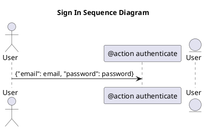

# Наименование на русском языке 1234567890

!!! note

    Lorem ipsum dolor sit amet, consectetur adipiscing elit. Nulla et euismod
    nulla. Curabitur feugiat, tortor non consequat finibus, justo purus auctor
    massa, nec semper lorem quam in massa.
	
!!! note "Phasellus posuere in sem ut cursus"

    Lorem ipsum dolor sit amet, consectetur adipiscing elit. Nulla et euismod
    nulla. Curabitur feugiat, tortor non consequat finibus, justo purus auctor
    massa, nec semper lorem quam in massa.	

??? question

    Lorem ipsum dolor sit amet, consectetur adipiscing elit. Nulla et euismod
    nulla. Curabitur feugiat, tortor non consequat finibus, justo purus auctor
    massa, nec semper lorem quam in massa.

!!! info inline end "Lorem ipsum"

    Lorem ipsum dolor sit amet, consectetur
    adipiscing elit. Nulla et euismod nulla.
    Curabitur feugiat, tortor non consequat
    finibus, justo purus auctor massa, nec
    semper lorem quam in massa.

The HTML specification is maintained by the W3C.

*[HTML]: Hyper Text Markup Language
*[W3C]: World Wide Web Consortium

Text can be {--deleted--} and replacement text {++added++}. This can also be
combined into {~~one~>a single~~} operation. {==Highlighting==} is also
possible {>>and comments can be added inline<<}.

{==

Formatting can also be applied to blocks by putting the opening and closing
tags on separate lines and adding new lines between the tags and the content.

==}


## Важная диаграмма plantuml




## Front Matter

| ddasd     | dasdasdasd | asdasd   | вфыв   | rqrqwrqwrqwr |
|-----------|------------|----------|--------|--------------|
| asdasdasd | test1      | asdff    | фывфыв | test2        |
| sddd      |            | 2        | 3      | 4            |
| asdasd    | gtgq       | ffffffff | 2323   | asdqw        |


```text title="my-doc.md"
// highlight-start
---
id: my-doc-id
title: My document title
description: My document description
slug: /my-custom-url
---
// highlight-end

## Markdown heading

Markdown text with [links](./hello.md)
```

## Lindasd

Regular Markdown links are supported, using url paths or relative file paths.

```md
Let's see how to [Create a page](/create-a-page).
```

```md
Let's see how to [Create a page](./create-a-page.md).
```

**Result:** Let's see how to [Create a page](./create-a-page.md).

## Images

Regular Markdown images are supported.

You can use absolute paths to reference images in the static directory (`static/img/docusaurus.png`):

```md

```


You can reference images relative to the current file as well. This is particularly useful to colocate images close to the Markdown files using them:

```md

```

## Code Blocks

Markdown code blocks are supported with Syntax highlighting.

````md
```jsx title="src/components/HelloDocusaurus.js"
function HelloDocusaurus() {
  return <h1>Hello, Docusaurus!</h1>;
}
```
````

```jsx title="src/components/HelloDocusaurus.js"
function HelloDocusaurus() {
  return <h1>Hello, Docusaurus!</h1>;
}
```

## Admonitions

Docusaurus has a special syntax to create admonitions and callouts:

```md
:::tip My tip

Use this awesome feature option

:::

:::danger Take care

This action is dangerous

:::
```

:::tip My tip

Use this awesome feature option

:::

:::danger Take care

This action is dangerous

:::

## MDX and React Components

[MDX](https://mdxjs.com/) can make your documentation more **interactive** and allows using any **React components inside Markdown**:

```jsx
export const Highlight = ({children, color}) => (
  <span
    style={{
      backgroundColor: color,
      borderRadius: '20px',
      color: '#fff',
      padding: '10px',
      cursor: 'pointer',
    }}
    onClick={() => {
      alert(`You clicked the color ${color} with label ${children}`)
    }}>
    {children}
  </span>
);

This is <Highlight color="#25c2a0">Docusaurus green</Highlight> !

This is <Highlight color="#1877F2">Facebook blue</Highlight> !
```

export const Highlight = ({children, color}) => (
  <span
    style={{
      backgroundColor: color,
      borderRadius: '20px',
      color: '#fff',
      padding: '10px',
      cursor: 'pointer',
    }}
    onClick={() => {
      alert(`You clicked the color ${color} with label ${children}`);
    }}>
    {children}
  </span>
);

This is <Highlight color="#25c2a0">Docusaurus green</Highlight> !

This is <Highlight color="#1877F2">Facebook blue</Highlight> !
